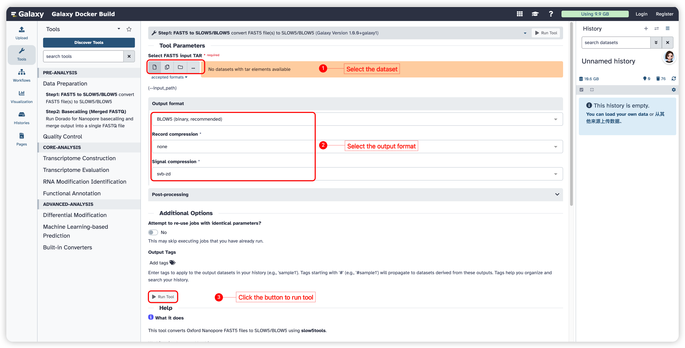
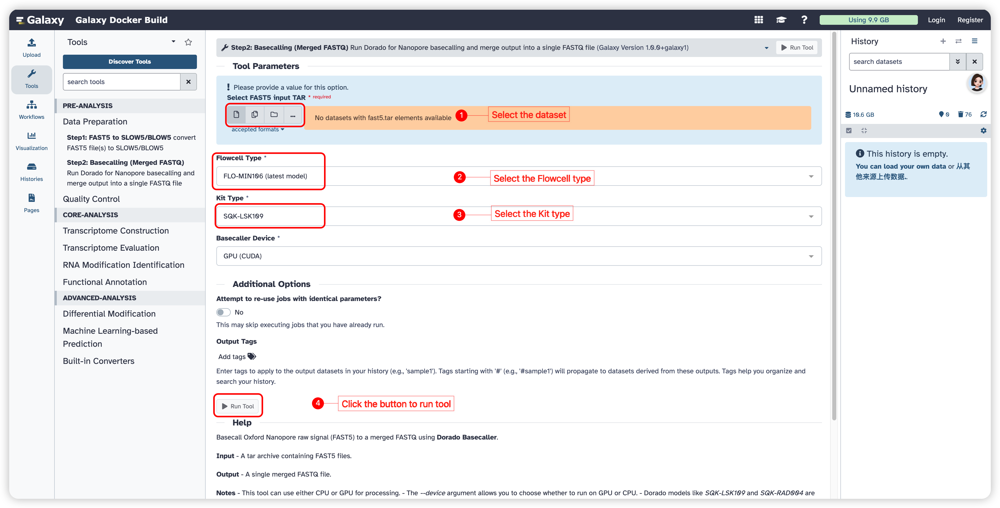
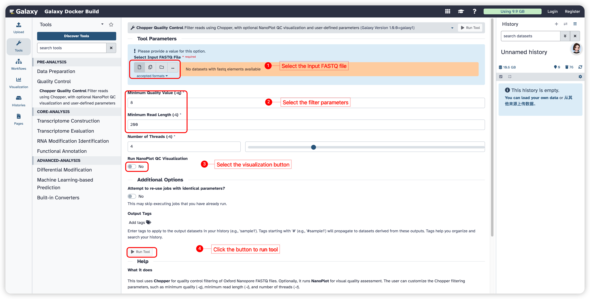

<strong>FreeFlow-ONT User Manual</strong>

(version 1.0)

- FreeFlow-ONT is a Galaxy-based framework for the analysis of Oxford Nanopore Technologies direct RNA sequencing (ONT DRS) data. It provides an integrated and user-friendly environment that supports key steps of ONT DRS analysis, including data preprocessing, alignment, transcript-level analysis, and downstream functional exploration. The framework is designed to improve accessibility, standardization, and efficiency in ONT DRS data analysis for both routine and advanced research applications.
- FreeFlow-ONT was powered with an advanced  packaging technology, which enables compatibility and portability.
- FreeFlow-ONT project is hosted on https://github.com/jy-ai/FreeFlow-ONT
- FreeFlow-ONT docker image is available at https://hub.docker.com/r/malab/freeflowont

## Data Preparation Module

This module prepares raw Oxford Nanopore Technologies (ONT) sequencing data for downstream analysis. It includes two tools: **FAST5 to SLOW5 Conversion** and **Basecalling**. The first tool converts raw FAST5 files into SLOW5/BLOW5 format to improve data accessibility and computational efficiency, while the second tool translates raw electrical signals into nucleotide sequences in FASTQ format.

| **Tools** | **Description** | **Input** | **Output** | **Time (test data)** | **Reference** |
|-------------------------------|------------------------------------------------------------|-----------------------------------------------|-------------------------------------------------|----------------------------|------------------------------------------------------------|
| **FAST5 to SLOW5** | Convert raw ONT FAST5 files into SLOW5/BLOW5 format for efficient downstream analysis | FAST5 files | SLOW5/BLOW5 files | Depends on the file size | <a href="https://hasindu2008.github.io/slow5tools/" target="_blank">slow5tools</a> |
| **Basecalling** | Convert raw nanopore signal data into nucleotide sequences | FAST5 or SLOW5/BLOW5 files | FASTQ files | Depends on the dataset size and hardware configuration | ONT basecaller |

## FAST5 to SLOW5

This function is designed to convert raw ONT sequencing data from **FAST5** format into **SLOW5** or **BLOW5** format. Compared with FAST5, SLOW5/BLOW5 provides a more efficient and lightweight format for raw nanopore signal storage and can improve the performance of downstream analysis tools.

#### Input

- **Input FAST5 files:** Raw ONT sequencing files in FAST5 format.
- **Input type:** Single-FAST5 files or a directory/archive containing multiple FAST5 files.

#### Parameters

- **Output format:** Select the output format as **SLOW5** or **BLOW5**.
- **Compression mode:** Optional, specify whether compressed output should be generated.

#### Output

- **Converted SLOW5/BLOW5 file(s)** for downstream analysis.

## Basecalling

This function is designed to convert raw nanopore electrical signals into nucleotide sequences through basecalling. The generated sequence reads are saved in **FASTQ** format and can be used for downstream analyses such as alignment, transcript quantification, and modification detection.

#### Input

- **Input raw signal files:** FAST5 or SLOW5/BLOW5 files generated from ONT sequencing.
-  **Model file or model selection:** A basecalling model specified by the  selected from the available presets.

#### Parameters

- **Basecalling model:** Select the appropriate model for RNA or DNA data, depending on the sequencing type.
- **Device:** Choose CPU or GPU for basecalling.

#### Output

- **Basecalled reads in FASTQ format**

## Quality Control Module

This module is designed to improve the quality of ONT sequencing reads before downstream analysis. It currently includes the **Chopper Quality Control** tool, which filters reads according to user-defined quality and length thresholds. An optional **NanoPlot** report can also be generated for visual quality assessment.

| **Tools**                   | **Description**                                              | **Input**  | **Output**                                         | **Time (test data)**        | **Reference**                                                |
| --------------------------- | ------------------------------------------------------------ | ---------- | -------------------------------------------------- | --------------------------- | ------------------------------------------------------------ |
| **Chopper Quality Control** | Filter ONT reads by minimum quality and read length, with optional NanoPlot QC visualization | FASTQ file | Filtered FASTQ file; optional NanoPlot HTML report | Depends on the dataset size | <a href="https://github.com/wdecoster/chopper" target="_blank">Chopper</a>; <a href="https://github.com/wdecoster/NanoPlot" target="_blank">NanoPlot</a> |

## Chopper Quality Control

This function is designed to filter Oxford Nanopore sequencing reads in **FASTQ** format using **Chopper**. Reads can be retained according to user-defined thresholds for minimum base quality and minimum read length. In addition, users may optionally run **NanoPlot** to generate a visual quality control report for the filtered reads.

#### Input

- **Input FASTQ file:** A FASTQ file containing ONT sequencing reads.

#### Parameters

- **Minimum Quality Value (-q):** An integer specifying the minimum average read quality required for a read to be retained. The default value is **8**.
- **Minimum Read Length (-l):** An integer specifying the minimum read length required for a read to be retained. The default value is **200**.
- **Number of Threads (-t):** An integer specifying the number of CPU threads used during filtering. The default value is **4**.
- **Run NanoPlot QC Visualization:** Select whether to generate an additional **NanoPlot** HTML report for visual inspection of the filtered reads.

#### Output

- **Filtered FASTQ file:** A FASTQ file containing reads that pass the user-defined quality and length thresholds.
- **NanoPlot report (optional):** An HTML report summarizing read length and quality distributions of the filtered dataset when NanoPlot visualization is enabled.

#### Notes

- **Chopper** is used to remove low-quality and short reads from ONT FASTQ files.
- The filtering process is controlled by user-defined thresholds for quality and read length.
- When enabled, **NanoPlot** provides graphical summaries that help users evaluate the quality of the filtered reads.

