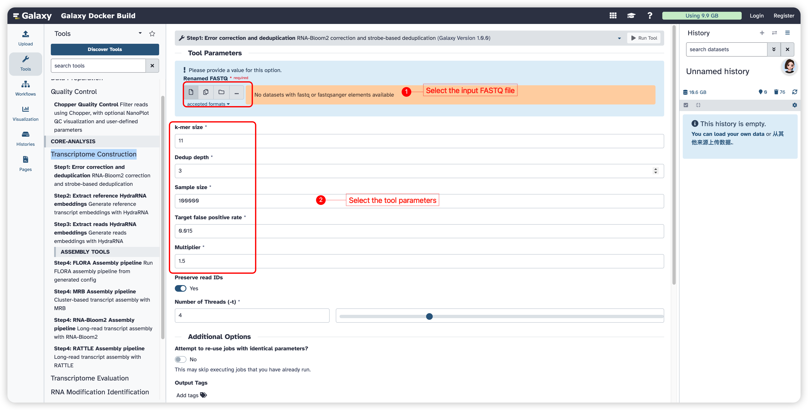
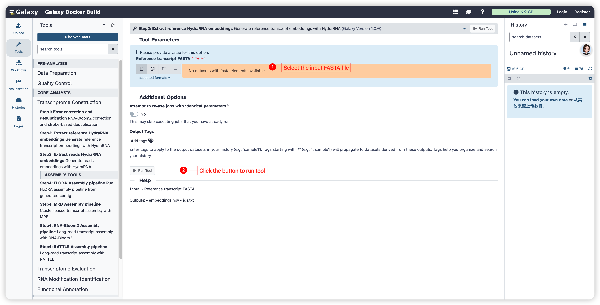
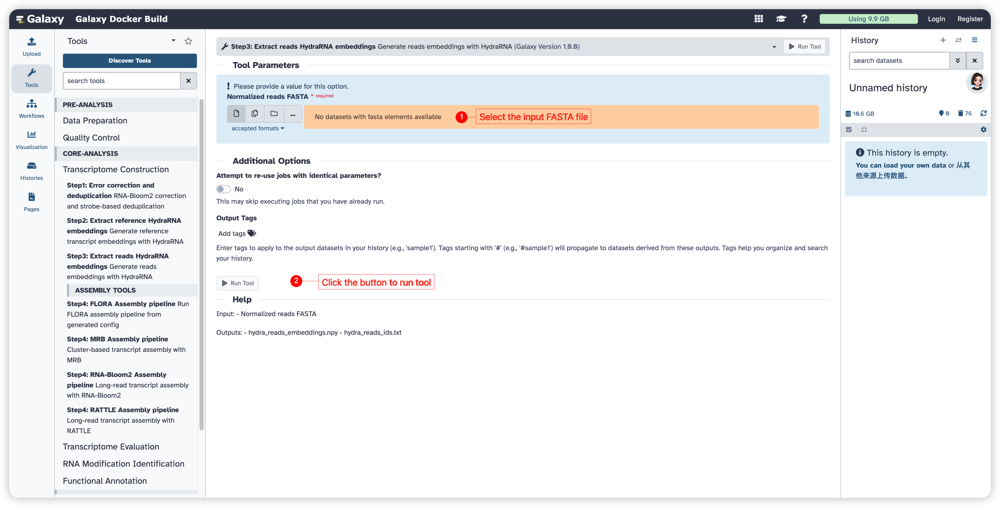
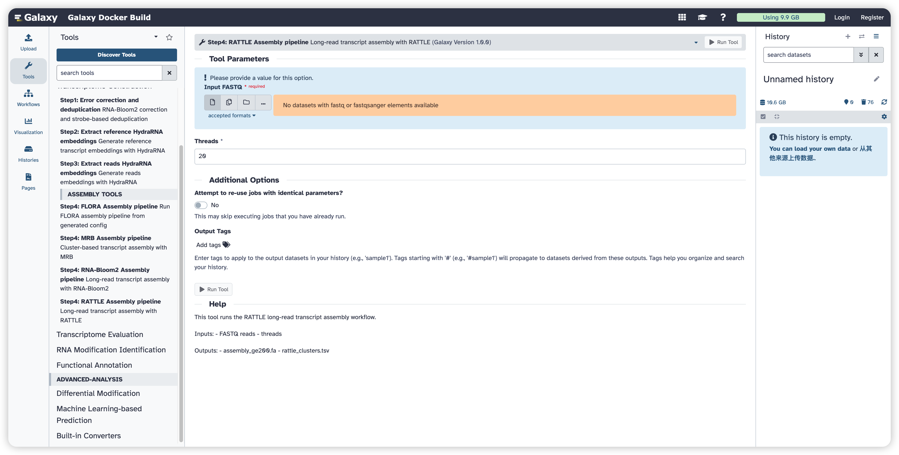

<strong>FreeFlow-ONT User Manual</strong>

(version 1.0)

- FreeFlow-ONT is a user-friendly and modular platform designed for reference genome-free m^6^A analysis of Oxford Nanopore Technologies direct RNA sequencing (ONT DRS) data. It aims to support streamlined, end-to-end analysis under conditions where high-quality reference genomes or annotations are unavailable. By integrating long-read transcriptome assembly, m^6^A modification identification, differential modification analysis, and machine learning-based prediction into a unified Galaxy environment, FreeFlow-ONT enables reproducible and flexible analysis of plant m^6^A data from raw signals to biologically interpretable results. FreeFlow-ONT comprises eight functional modules:  **Data Preparation, Quality Control, Transcriptome Construction, Transcriptome Evaluation, RNA Modification Identification, Functional Annotation, Differential Modification Analysis, and Machine Learning-based Prediction**.
- FreeFlow-ONT was powered with an advanced  packaging technology, which enables compatibility and portability.
- FreeFlow-ONT project is hosted on https://github.com/jy-ai/FreeFlow-ONT
- FreeFlow-ONT docker image is available at https://hub.docker.com/r/malab/freeflowont

## Transcriptome Construction Module

This module is designed for transcriptome construction from long-read sequencing data. It includes three preparatory steps, namely **error correction and deduplication**, **reference transcript embedding extraction**, and **read embedding extraction**, followed by multiple transcript assembly pipelines. According to the analysis design, users can select one of the available assembly tools, including **FLORA**, **MRB**, **RNA-Bloom2**, and **RATTLE**, for downstream transcriptome construction.

| **Tools**                                        | **Description**                                                      | **Input**                                                                            | **Output**                                    | **Time (test data)**                         | **Reference** |
| ------------------------------------------------------ | -------------------------------------------------------------------------- | ------------------------------------------------------------------------------------------ | --------------------------------------------------- | -------------------------------------------------- | ------------------- |
| **Step1: Error Correction and Deduplication**    | Perform RNA-Bloom2 correction and strobe-based deduplication/normalization | Renamed FASTQ                                                                              | corrected.fa; normalized.fa                         | Depends on the dataset size                        | RNA-Bloom2          |
| **Step2: Extract Reference HydraRNA Embeddings** | Generate reference transcript embeddings with HydraRNA                     | Reference transcript FASTA                                                                 | embeddings.npy; ids.txt                             | Depends on the dataset size                        | HydraRNA            |
| **Step3: Extract Reads HydraRNA Embeddings**     | Generate read embeddings with HydraRNA                                     | Normalized reads FASTA                                                                     | hydra_reads_embeddings.npy; hydra_reads_ids.txt     | Depends on the dataset size                        | HydraRNA            |
| **Step4: FLORA Assembly Pipeline**               | Run the FLORA assembly workflow using read and reference embeddings        | Normalized reads FASTA, reads embeddings, reference transcript FASTA, reference embeddings | contigs_all.raw.fa; assembly_ge200.fa               | Depends on the dataset size and parameter settings | FLORA               |
| **Step4: MRB Assembly Pipeline**                 | Run cluster-based transcript assembly with MRB                             | FASTQ, reference transcript FASTA, genome FASTA                                            | assembly_ge200.fa; cluster_script.log; assembly.log | Depends on the dataset size and parameter settings | MRB                 |
| **Step4: RNA-Bloom2 Assembly Pipeline**          | Run long-read transcript assembly with RNA-Bloom2                          | FASTQ                                                                                      | assembly_ge200.fa; run log                          | Depends on the dataset size                        | RNA-Bloom2          |
| **Step4: RATTLE Assembly Pipeline**              | Run long-read transcript assembly with RATTLE                              | FASTQ                                                                                      | assembly_ge200.fa; rattle_clusters.tsv              | Depends on the dataset size                        | RATTLE              |

## Step1: Error Correction and Deduplication

This function is designed to perform **RNA-Bloom2 long-read error correction** and **strobe-based deduplication/normalization**. It takes a renamed FASTQ file as input and generates corrected and normalized read files in FASTA format for downstream analysis.

#### Input

- **Renamed FASTQ:** A FASTQ file containing renamed sequencing reads.

#### Parameters

- **k-mer size:** An integer specifying the k-mer size used during correction. The default value is **11**.
- **Dedup depth:** An integer specifying the deduplication depth. The default value is **3**.
- **Sample size:** An integer specifying the number of reads sampled during processing. The default value is **100000**.
- **Target false positive rate:** A float specifying the target false positive rate. The default value is **0.015**.
- **Multiplier:** A float specifying the multiplier used during processing. The default value is **1.5**.
- **Preserve read IDs:** Select whether to preserve original read IDs during processing. The default setting is **enabled**.
- **Number of Threads (-t):** An integer specifying the number of CPU threads used during processing. The default value is **4**.

#### Output

- **corrected.fa:** Corrected reads in FASTA format.
- **normalized.fa:** Deduplicated or normalized reads in FASTA format.

## Step2: Extract Reference HydraRNA Embeddings

This function is designed to generate reference transcript embeddings using **HydraRNA**. It takes a reference transcript FASTA file as input and produces the corresponding embedding matrix and transcript ID file.

#### Input

- **Reference transcript FASTA:** A FASTA file containing reference transcript sequences.

#### Output

- **embeddings.npy:** A NumPy file containing HydraRNA embeddings for the reference transcripts.
- **ids.txt:** A text file containing the transcript IDs corresponding to the embeddings.

## Step3: Extract Reads HydraRNA Embeddings

This function is designed to generate read embeddings using **HydraRNA**. It takes normalized reads in FASTA format as input and produces both the embedding matrix and the corresponding read ID file.

#### Input

- **Normalized reads FASTA:** A FASTA file containing normalized reads generated from the previous step.

#### Output

- **hydra_reads_embeddings.npy:** A NumPy file containing HydraRNA embeddings for the reads.
- **hydra_reads_ids.txt:** A text file containing the read IDs corresponding to the embeddings.

## Assembly Tools

This module provides multiple assembly pipelines for transcriptome construction. Users can choose one assembly tool according to their analytical strategy and data characteristics. Each pipeline produces assembled transcript sequences, while some tools also generate additional log files or clustering results.

## Step4: FLORA Assembly Pipeline

This function is designed to run the **FLORA** assembly workflow using normalized reads, read embeddings, reference transcript sequences, and reference embeddings. It generates both raw contigs and final filtered transcript assemblies.

#### Input

- **Normalized reads FASTA**
- **Reads embeddings (.npy)**
- **Reads IDs (.txt)**
- **Reference transcripts FASTA**
- **Reference embeddings (.npy)**
- **Reference IDs (.txt)**

#### Parameters

- **Run tag:** A text string specifying the name of the analysis run. The default value is **flora_run**.
- **K_META:** An integer specifying the metadata clustering parameter. The default value is **32**.
- **TOPK:** An integer specifying the number of top candidates retained. The default value is **20**.
- **MIN_SCORE:** A float specifying the minimum score threshold. The default value is **0.15**.
- **MAX_RANK:** An integer specifying the maximum rank threshold. The default value is **5**.
- **MIN_SIM:** A float specifying the minimum similarity threshold. The default value is **0.96**.
- **minimap2 threads:** Number of CPU threads used by minimap2. The default value is **20**.
- **IVF threads:** Number of CPU threads used in IVF-related processing. The default value is **20**.
- **RNA-Bloom driver threads:** Number of driver threads used by RNA-Bloom. The default value is **4**.
- **RNA-Bloom driver jobs:** Number of RNA-Bloom jobs. The default value is **15**.
- **Java memory (GB):** Java memory allocation for the pipeline. The default value is **16**.
- **RNA-Bloom extra args:** Additional arguments passed to RNA-Bloom. The default value is **-lrrd 3**.
- **Pooled Java Xmx:** Java memory setting for pooled assembly. The default value is **16G**.
- **Pooled assembly threads:** Number of CPU threads used for pooled assembly. The default value is **20**.
- **Gather minimum contig length:** Minimum contig length retained during gathering. The default value is **200**.
- **Final minimum contig length:** Minimum contig length retained in the final assembly. The default value is **200**.
- **CD-HIT threads:** Number of CPU threads used by CD-HIT. The default value is **20**.

#### Output

- **contigs_all.raw.fa:** Raw contigs generated during assembly.
- **assembly_ge200.fa:** Final assembled transcripts after length filtering.

## Step4: MRB Assembly Pipeline

This function is designed to run the **MRB** assembly workflow for cluster-based transcript assembly. It requires FASTQ reads, a reference transcript FASTA file, and a genome FASTA file as input. In addition to the final assembly, it also produces workflow log files.

#### Input

- **Input FASTQ:** A FASTQ file containing sequencing reads.
- **Reference transcript FASTA:** A FASTA file containing reference transcript sequences.
- **Genome FASTA:** A FASTA file containing genome sequences.

#### Parameters

- **Sequencing type:** Select **dRNA**, **cDNA**, or **PacBio**. The default value is **dRNA**.
- **Threads:** An integer specifying the number of CPU threads used during processing. The default value is **20**.
- **MMseqs2 identity threshold:** A float specifying the sequence identity threshold. The default value is **0.7**.
- **MMseqs2 coverage threshold:** A float specifying the coverage threshold. The default value is **0.6**.
- **MMseqs2 coverage mode:** An integer specifying the MMseqs2 coverage mode. The default value is **1**.
- **MMseqs2 cluster mode:** An integer specifying the MMseqs2 cluster mode. The default value is **2**.
- **Do not force fill missing clusters:** Select whether missing clusters should not be force-filled. The default setting is **enabled**.
- **Enable contig coverage filter:** Select whether the contig coverage filter should be enabled. The default setting is **enabled**.
- **Coverage filter: minimum depth:** Minimum depth required for the coverage filter. The default value is **1**.
- **Coverage filter: minimum covered fraction:** Minimum covered fraction required for the coverage filter. The default value is **0.50**.
- **Coverage filter: minimum good bases:** Minimum number of good bases required. The default value is **0**.
- **Coverage filter: minimum MAPQ:** Minimum mapping quality required. The default value is **0**.
- **Coverage filter: maximum contig length:** Maximum contig length allowed, where **0** indicates no limit. The default value is **30000**.
- **Coverage filter threads:** Number of CPU threads used for coverage filtering. The default value is **20**.
- **Final minimum transcript length:** Minimum transcript length retained in the final assembly. The default value is **200**.
- **Allow secondary alignments in coverage filter:** Select whether secondary alignments are included in coverage filtering. The default setting is **enabled**.
- **CD-HIT threads:** Number of CPU threads used by CD-HIT. The default value is **20**.
- **CD-HIT identity threshold:** A float specifying the CD-HIT identity threshold. The default value is **0.99**.
- **CD-HIT word length:** An integer specifying the CD-HIT word length. The default value is **10**.
- **CD-HIT memory limit (MB):** Memory limit used by CD-HIT in MB. The default value is **50000**.

#### Output

- **assembly_ge200.fa:** Final assembled transcripts in FASTA format.
- **cluster_script.log:** Log file for the clustering step.
- **assembly.log:** Log file for the assembly step.

## Step4: RNA-Bloom2 Assembly Pipeline

This function is designed to run the **RNA-Bloom2** long-read transcript assembly workflow. It takes sequencing reads in FASTQ format as input and produces a final transcript assembly together with a run log file.

#### Input

- **Input FASTQ:** A FASTQ file containing sequencing reads.

#### Parameters

- **Sequencing type:** Select **dRNA**, **cDNA**, or **PacBio**. The default value is **dRNA**.
- **Threads:** An integer specifying the number of CPU threads used during processing. The default value is **20**.

#### Output

- **assembly_ge200.fa:** Final assembled transcripts in FASTA format.
- **run log:** Log file generated during pipeline execution.

## Step4: RATTLE Assembly Pipeline

This function is designed to run the **RATTLE** long-read transcript assembly workflow. It uses FASTQ reads as input and produces a final assembly together with a clustering result file.

#### Input

- **Input FASTQ:** A FASTQ file containing sequencing reads.

#### Parameters

- **Threads:** An integer specifying the number of CPU threads used during processing. The default value is **20**.

#### Output

- **assembly_ge200.fa:** Final assembled transcripts in FASTA format.
- **rattle_clusters.tsv:** A tabular file containing clustering results generated by RATTLE

