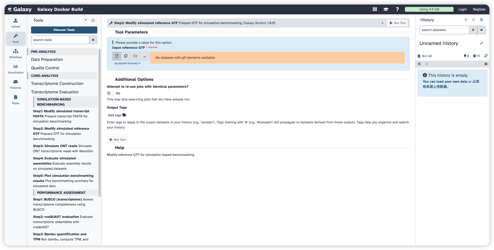
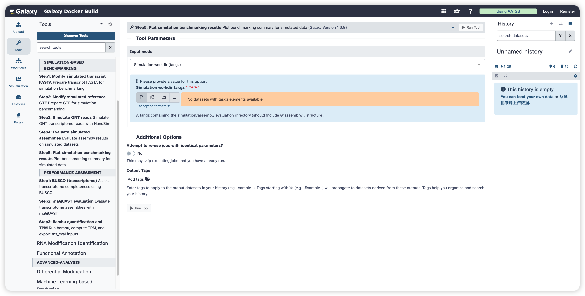
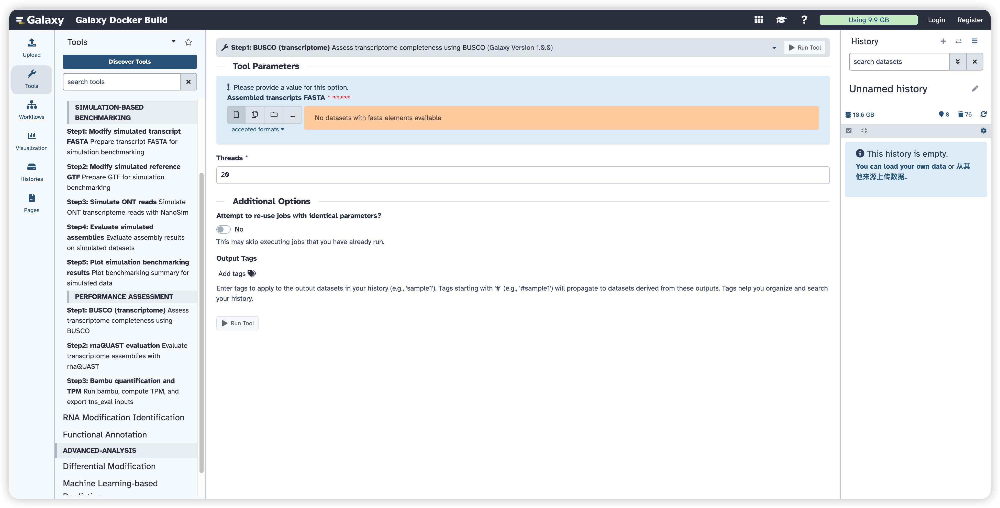
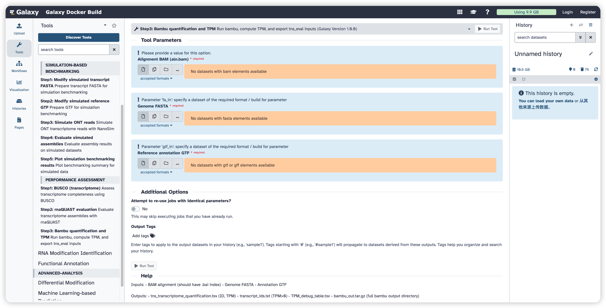

<strong>FreeFlow-ONT User Manual</strong>

(version 1.0)

- FreeFlow-ONT is a Galaxy-based framework for the analysis of Oxford Nanopore Technologies direct RNA sequencing (ONT DRS) data. It provides an integrated and user-friendly environment that supports key steps of ONT DRS analysis, including data preprocessing, alignment, transcript-level analysis, and downstream functional exploration. The framework is designed to improve accessibility, standardization, and efficiency in ONT DRS data analysis for both routine and advanced research applications.
- FreeFlow-ONT was powered with an advanced  packaging technology, which enables compatibility and portability.
- FreeFlow-ONT project is hosted on https://github.com/jy-ai/FreeFlow-ONT
- FreeFlow-ONT docker image is available at https://hub.docker.com/r/malab/freeflowont

## Transcriptome Evaluation Module

This module is designed to evaluate transcriptome assemblies through two complementary parts: **simulation-based benchmarking** and **performance assessment**. The simulation-based benchmarking section prepares reference files for simulation, generates ONT transcriptome reads, evaluates assembly results on simulated datasets, and summarizes benchmarking results visually. The performance assessment section provides assembly evaluation using **BUSCO**, **rnaQUAST**, and **bambu**-based quantification and TPM estimation.        

| **Tools**                                       | **Description**                                      | **Input**                                                    | **Output**                                                   | **Time (test data)**                               | **Reference** |
| ----------------------------------------------- | ---------------------------------------------------- | ------------------------------------------------------------ | ------------------------------------------------------------ | -------------------------------------------------- | ------------- |
| **Step1: Modify simulated transcript FASTA**    | Prepare transcript FASTA for simulation benchmarking | Transcript FASTA                                             | modified.fa                                                  | Depends on the dataset size                        | Custom script |
| **Step2: Modify simulated reference GTF**       | Prepare reference GTF for simulation benchmarking    | Reference GTF                                                | modified.gtf                                                 | Depends on the dataset size                        | Custom script |
| **Step3: Simulate ONT reads**                   | Simulate ONT transcriptome reads with NanoSim        | Reference genome FASTA, transcript FASTA, raw reads FASTQ    | simulated_subsets.tar.gz                                     | Depends on the dataset size and parameter settings | NanoSim       |
| **Step4: Evaluate simulated assemblies**        | Evaluate assembly results on simulated datasets      | Modified reference transcript FASTA, modified reference GTF, assembly FASTA | summary                                                      | Depends on the dataset size                        | Custom script |
| **Step5: Plot simulation benchmarking results** | Plot benchmarking summary for simulated data         | Simulation workdir tar.gz or single summary file             | plots.tar.gz                                                 | Depends on the dataset size                        | Custom script |
| **Step1: BUSCO (transcriptome)**                | Assess transcriptome completeness using BUSCO        | Assembled transcripts FASTA                                  | short_summary.BUSCO.txt; full_table.tsv; BUSCO_out.tar.gz    | Depends on the dataset size                        | BUSCO         |
| **Step2: rnaQUAST evaluation**                  | Evaluate transcriptome assemblies with rnaQUAST      | Transcript FASTA(s), reference genome FASTA, reference annotation | rnaQUAST.tar.gz                                              | Depends on the dataset size                        | rnaQUAST      |
| **Step3: Bambu quantification and TPM**         | Run bambu, compute TPM, and export evaluation inputs | Alignment BAM, genome FASTA, reference annotation GTF        | tns_transcriptome_quantification.tsv; transcript_ids.txt; TPM_debug_table.tsv; bambu_out.tar.gz | Depends on the dataset size                        | bambu         |

## Simulation-Based Benchmarking

This section is designed to benchmark transcriptome assembly results under simulated sequencing conditions. It includes reference preparation, ONT read simulation, assembly evaluation, and result visualization.     

## Step1: Modify simulated transcript FASTA

This function is designed to prepare transcript FASTA files for simulation-based benchmarking. It takes a transcript FASTA file as input and generates a modified FASTA file for downstream simulation analysis. 

#### Input

- **Input transcript FASTA:** A FASTA file containing transcript sequences. 

#### Output

- **modified.fa:** A modified transcript FASTA file for simulation benchmarking. 

## Step2: Modify simulated reference GTF

This function is designed to prepare reference annotation files for simulation-based benchmarking. It takes a reference GTF file as input and generates a modified GTF file for downstream simulation analysis. 

#### Input

- **Input reference GTF:** A GTF file containing reference transcript annotations. 

#### Output

- **modified.gtf:** A modified GTF file for simulation benchmarking. 

## Step3: Simulate ONT Reads

This function is designed to simulate ONT transcriptome reads using **NanoSim**. It uses a reference genome FASTA file, a transcript FASTA file, and raw reads in FASTQ format as input, and generates a compressed archive containing the simulation working directory and simulated subset FASTQ files. 

#### Input

- **Reference genome FASTA:** A FASTA file containing the reference genome sequence. 
- **Transcript FASTA:** A FASTA file containing transcript sequences for simulation. 
- **Raw reads FASTQ:** A FASTQ file containing raw sequencing reads used for training the simulator. 

#### Parameters

- **Training sample size:** An integer specifying the number of reads used for simulator training. The default value is **1000000**. 
- **Basecaller name:** A text string specifying the basecaller name. The default value is **guppy**. 
- **Subset sizes:** A text string specifying the simulated subset sizes. The default value is **2M,10M,18M**. 
- **Threads:** An integer specifying the number of CPU threads used during simulation. The default value is **20**. 
- **Total simulated reads:** An integer specifying the total number of simulated reads. The default value is **25000000**. 
- **Gzip simulated FASTQ output:** Select whether the simulated FASTQ files should be compressed. The default setting is **enabled**. 
- **Skip quantify if result exists:** Select whether the quantification step should be skipped if previous results already exist. The default setting is **disabled**. 
- **Skip training if result exists:** Select whether the training step should be skipped if previous results already exist. The default setting is **disabled**. 

#### Output

- **simulated_subsets.tar.gz:** A compressed archive containing the simulation working directory and subset FASTQ files. 

## Step4: Evaluate Simulated Assemblies

This function is designed to evaluate transcriptome assembly results on simulated datasets. It takes the modified reference transcript FASTA file, modified reference GTF file, and the assembly FASTA file to be evaluated as input, and produces a summary result file. 

#### Input

- **Modified reference transcript FASTA:** A FASTA file generated for simulation benchmarking. 
- **Modified reference GTF:** A GTF file generated for simulation benchmarking. 
- **Assembly FASTA to evaluate:** A FASTA file containing assembled transcript sequences to be evaluated. 

#### Output

- **summary:** A tabular summary file containing the evaluation results. 

## Step5: Plot Simulation Benchmarking Results

This function is designed to generate visual summaries of benchmarking results for simulated data. It accepts either a simulation workdir archive or a single summary file as input and produces a compressed archive containing the generated plots. 

#### Input

- **Input mode:** Select the input type for plotting. Available options are **Simulation workdir (tar.gz)** and **Single summary file (results_summary.txt)**. 
- **Simulation workdir tar.gz:** A compressed archive containing the simulation and assembly evaluation directory. 
- **Single summary file:** A tab-delimited summary file containing benchmarking results. 

#### Output

- **plots.tar.gz:** A compressed archive containing the generated benchmarking plots. 

## Performance Assessment

This section is designed to assess transcriptome assembly quality from multiple aspects, including completeness, structural consistency, and abundance-related support. It includes **BUSCO**, **rnaQUAST**, and **bambu**-based quantification and TPM calculation.   

## Step1: BUSCO (transcriptome)

This function is designed to assess transcriptome completeness using **BUSCO**. It takes assembled transcripts in FASTA format as input and produces both summary and detailed evaluation outputs. 

#### Input

- **Assembled transcripts FASTA:** A FASTA file containing assembled transcript sequences. 

#### Parameters

- **Threads:** An integer specifying the number of CPU threads used during BUSCO analysis. The default value is **20**. 

#### Output

- **short_summary.BUSCO.txt:** A short summary file reporting BUSCO completeness results. 
- **full_table.tsv:** A tabular file containing detailed BUSCO results. 
- **BUSCO_out.tar.gz:** A compressed archive containing the full BUSCO output directory. 

## Step2: rnaQUAST Evaluation

This function is designed to evaluate transcriptome assemblies using **rnaQUAST**. It supports one or more transcript FASTA files as input together with a reference genome FASTA file and a reference annotation file. 

#### Input

- **Transcript FASTA(s) to evaluate:** One or more FASTA files containing transcript assemblies. 
- **Reference genome FASTA:** A FASTA file containing the reference genome sequence. 
- **Reference annotation (GTF/GFF3):** A GTF or GFF3 file containing reference annotations. 

#### Parameters

- **Strand-specific transcripts (-ss):** Select whether the input transcripts are strand-specific. The default setting is **disabled**. 
- **Threads:** An integer specifying the number of CPU threads used during evaluation. The default value is **15**. 

#### Output

- **rnaQUAST.tar.gz:** A compressed archive containing the full rnaQUAST evaluation results. 

## Step3: Bambu Quantification and TPM

This function is designed to run **bambu**, compute transcript TPM values, and export files for downstream evaluation. It takes an alignment BAM file, a genome FASTA file, and a reference annotation GTF file as input, and generates TPM-related output files together with the full bambu result directory. 

#### Input

- **Alignment BAM (aln.bam):** A BAM file containing sequence alignments. The BAM file should have a corresponding **.bai** index. 
- **Genome FASTA:** A FASTA file containing the genome sequence. 
- **Reference annotation GTF:** A GTF or GFF file containing reference transcript annotations. 

#### Output

- **tns_transcriptome_quantification.tsv:** A tabular file containing transcript IDs and TPM values. 
- **transcript_ids.txt:** A text file containing transcript IDs with TPM greater than zero. 
- **TPM_debug_table.tsv:** A tabular file containing TPM debugging information. 
- **bambu_out.tar.gz:** A compressed archive containing the full bambu output directory. 

