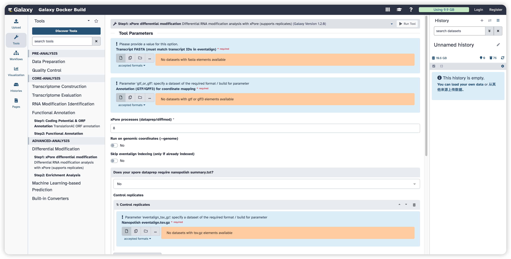
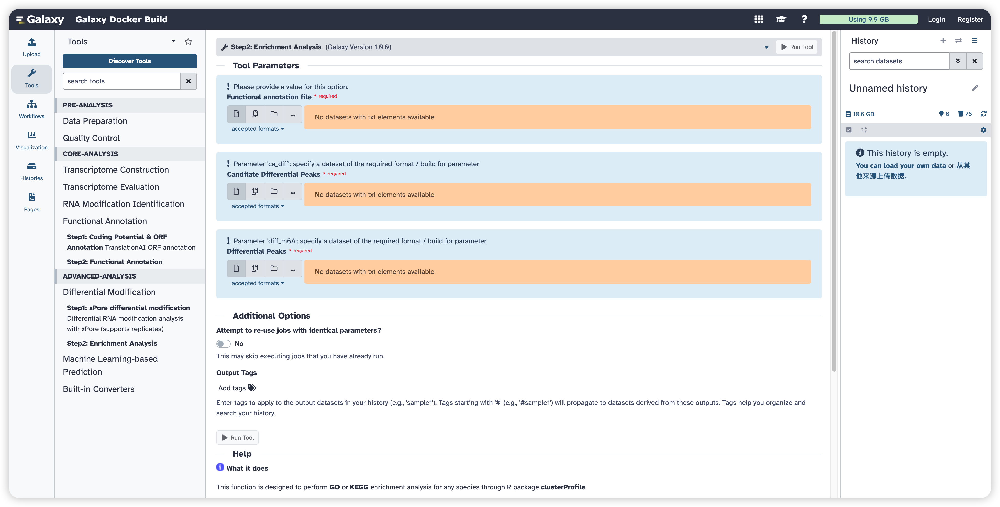

<strong>FreeFlow-ONT User Manual</strong>

(version 1.0)

- FreeFlow-ONT is a Galaxy-based framework for the analysis of Oxford Nanopore Technologies direct RNA sequencing (ONT DRS) data. It provides an integrated and user-friendly environment that supports key steps of ONT DRS analysis, including data preprocessing, alignment, transcript-level analysis, and downstream functional exploration. The framework is designed to improve accessibility, standardization, and efficiency in ONT DRS data analysis for both routine and advanced research applications.
- FreeFlow-ONT was powered with an advanced  packaging technology, which enables compatibility and portability.
- FreeFlow-ONT project is hosted on https://github.com/jy-ai/FreeFlow-ONT
- FreeFlow-ONT docker image is available at https://hub.docker.com/r/malab/freeflowont

## Differential Modification Module

This module is designed to identify and interpret differential RNA modification events between experimental groups. It includes two steps: **xPore-based differential modification analysis** and **functional enrichment analysis**. In the first step, **xPore** is used to perform differential RNA modification analysis from eventalign data and supports replicate-based comparisons. In the second step, the resulting differential modification candidates are subjected to **GO** and **KEGG** enrichment analysis for downstream biological interpretation.  

| **Tools**                                  | **Description**                                              | **Input**                                                    | **Output**                                                   | **Time (test data)**                                 | **Reference**   |
| ------------------------------------------ | ------------------------------------------------------------ | ------------------------------------------------------------ | ------------------------------------------------------------ | ---------------------------------------------------- | --------------- |
| **Step1: xPore differential modification** | Perform differential RNA modification analysis with xPore and support replicate-based comparison | Transcript FASTA, annotation GTF/GFF3, control and treatment eventalign files | xpore_summary; xpore_out.tar.gz                              | Depends on the dataset size and number of replicates | xPore           |
| **Step2: Enrichment Analysis**             | Perform GO and KEGG enrichment analysis for differential modification results | Functional annotation file, candidate differential peaks, differential peaks | GO enrichment result; GO enrichment dotplot; KEGG enrichment result; KEGG enrichment dotplot | Depends on the dataset size                          | clusterProfiler |

## Step1: xPore Differential Modification

This function is designed to perform differential RNA modification analysis using **xPore**. It supports replicate-based comparisons between control and treatment groups. For each replicate, the tool first runs **xPore dataprep**, then automatically generates the required xPore configuration file, and finally performs **xPore diffmod** to identify differential modification signals. 

#### Input

- **Transcript FASTA:** A FASTA file containing transcript sequences. The transcript IDs should match those used in the eventalign files. 
- **Annotation (GTF/GFF3):** A GTF or GFF3 file used for coordinate mapping during xPore analysis. 
- **Control replicates:** One or more eventalign TSV.GZ files for the control group. If required, corresponding Nanopolish summary files can also be provided. 
- **Treatment replicates:** One or more eventalign TSV.GZ files for the treatment group. If required, corresponding Nanopolish summary files can also be provided. 

#### Parameters

- **xPore processes (dataprep/diffmod):** An integer specifying the number of processes used for both dataprep and diffmod. The default value is **8**. 
- **Run on genomic coordinates (--genome):** Select whether xPore should run on genomic coordinates. The default setting is **disabled**. 
- **Skip eventalign indexing:** Select whether eventalign indexing should be skipped. This should only be enabled when the eventalign files have already been indexed. The default setting is **disabled**. 
- **Does your xpore dataprep require nanopolish summary.txt?:** Select whether Nanopolish summary files are required for dataprep. The default setting is **No**. 

#### Output

- **xpore_summary:** A tabular file containing the main summary of xPore differential modification results. 
- **xpore_out.tar.gz:** A compressed archive containing the full xPore output directory and configuration file. 

## Step2: Enrichment Analysis

This function is designed to perform **GO** and **KEGG** enrichment analysis for differential modification results. It uses the transcript functional annotation file together with candidate and significant differential peaks as input, and generates both tabular enrichment results and graphical dotplots in PDF format. 

#### Input

- **Functional annotation file:** A TXT file containing transcript functional annotation results, typically generated from the functional annotation module. 
- **Canditate Differential Peaks:** A TXT file containing candidate differential peaks. 
- **Differential Peaks:** A TXT file containing the final differential peaks used for enrichment analysis. 

#### Output

- **GO enrichment result:** A TXT file containing enriched GO terms. 
- **GO enrichment dotplot:** A PDF file showing the top enriched GO terms. 
- **KEGG enrichment result:** A TXT file containing enriched KEGG pathways. 
- **KEGG enrichment dotplot:** A PDF file showing the top enriched KEGG pathways. 

## Notes

- The xPore workflow in this module supports **replicate-aware differential modification analysis** by separately processing control and treatment replicates before running diffmod. 
- The enrichment analysis step provides downstream biological interpretation for differential modification results through **GO** and **KEGG** analysis. 
